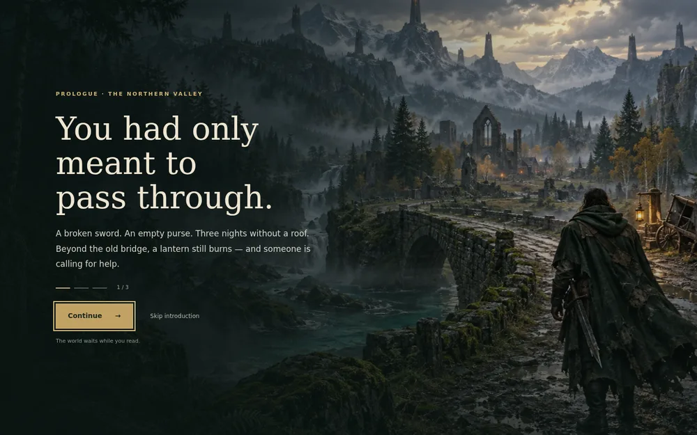
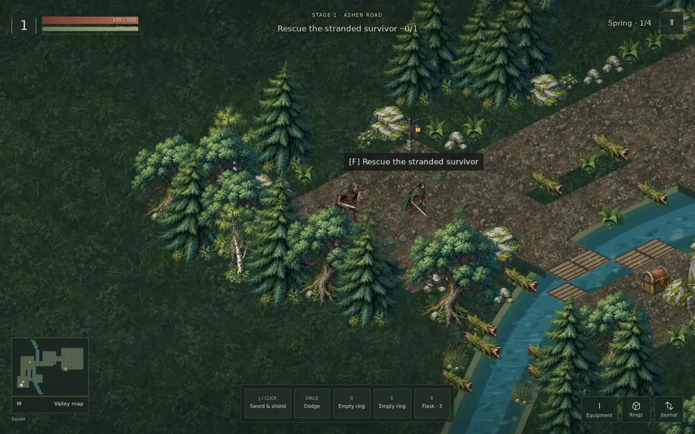
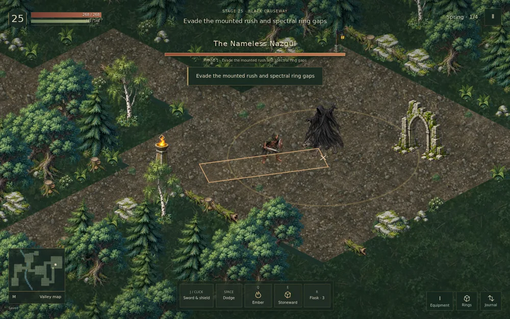

# Living Valley — update 0.2

Ovaj update poboljšava postojeću kampanju od 30 etapa. Obuhvata okoliš, prikaz borbe i tok priče; ne dodaje nove kampanjske nivoe.

## Šta se mijenja

- Novi lokalni atlas s 16 prirodnih elemenata: hrast, breza, jela, suho drvo, stijene, trupci, paprati, cvijeće, trska i ostaci građevina. Velike krošnje su udaljene od neposrednog ruba staze. Naselje koristi isti stil vegetacije.
- Rijeke s obalama, kamenjem ispod površine i blagim pomjeranjem odsjaja; pećine i tvrđava zadržavaju kamen i lavu. Na mjestima gdje rijeka siječe postojeći put nastaje prohodna drvena podloga. Nijedan obavezni cilj nije zatvoren vodom.
- Drvo više ne nestaje zbog same blizine igrača. Samo krošnja koja zaklanja glavu postepeno prelazi na 48% neprozirnosti; donji dio stabla ostaje neproziran. Diskretan obris dodatno otkriva položaj putnika.
- Putnik ima 12 originalnih poza za mač, kretanje, odbranu, izbjegavanje, pogodak i smrt; luk i sjekira imaju po četiri zasebne poze. Osam porodica neprijatelja ima po četiri poze za mirovanje, pripremu, napad i reakciju. Kretanje neprijatelja još koristi pomjeranje i transformacije tih poza.
- Šteta nastaje u trenutku kontakta, nakon 75 ms za mač, 120 ms za luk i 180 ms za sjekiru. Dodani su trag zamaha, čestice kontakta i čitljiv vrh strijele. Izbjegavanje prekida još nezavršen zamah.
- Juriši se kreću kroz prostor uz provjeru sudara. Oznaka skoka čeka doskok; ne pogađa već na početku skoka. Priprema i oporavak ostaju prilike za kontraigru.
- Prolog u tri stranice, Aldin razgovor, otkriće Embera, prvi povratak kući, uvodi u naredna poglavlja i osvrt nakon vraćenih svjetionika. Oba završetka imaju dvodijelni epilog. Dnevnik nudi ponovno čitanje prologa.
- Softverski WebGL automatski prelazi na brži Canvas; na podržanom hardveru ostaje automatski izbor WebGL-a. Prikaz koristi browserov requestAnimationFrame.
- Tokom priče vrijeme igre miruje. Nema automatskog odbrojavanja ni postepenog ispisivanja slova; tekst je odmah dostupan, a prolog se može preskočiti.

## Istraživanje i odluke

Ovo je kvalitativni pregled nekoliko konkretnih rasprava i službenih primjera, a ne anketa svih igrača. Mišljenja zajednice nisu tretirana kao univerzalni zahtjevi.

| Pregledani izvor | Zapažanje i primjena |
|---|---|
| [Riot: Clarity in League, 2021](https://www.leagueoflegends.com/en-us/news/dev/clarity-in-league/) | Jasna silueta, smjer i važnost efekta pomažu brzom razumijevanju borbe. Primjena: razlikovanje oružja kroz poze, usmjereni projektili, tragovi usklađeni sa smjerom i dometom udarca, mirniji okoliš ispod upozorenja. |
| [Reddit: Summoner’s Rift pre-beta footage, 2014](https://www.reddit.com/r/leagueoflegends/comments/27eiz5/update_to_summoners_rift_pre_beta_footage/) | Rasprava o slikarskim teksturama, prigušenim bojama podloge i performansama; prisutan je i odgovor Riotovog umjetnika o čitljivosti. Primjena: slojevita priroda, manje kontrasta na zemlji, ograničen broj čestica i skrivanje elemenata izvan kadra. |
| [Reddit: osvrt na izgled Summoner’s Rifta, 2019](https://www.reddit.com/r/leagueoflegends/comments/bufx3m/its_hard_to_believe_that_the_new_summoners_rift/) | Dio komentara cijeni dugovječan slikarski izgled; drugi ukazuju na probleme razumijevanja visine i projektila. Primjena: stilska dosljednost, ne oslanjanje na samo jednu lijepu ilustraciju. |
| [Last Epoch: animacije i reakcije na pogotke, 2026](https://forum.lastepoch.com/t/new-items-animations-and-quality-of-life-coming-to-last-epoch-march-26/80545) | Službeni prikaz reakcija neprijatelja i unaprijeđenih animacija, uz komentare o dostupnosti teksta i kontroli. Primjena: odvojene faze napada, reakcija na kontakt, odmah vidljiv tekst. Ovo izdanje koristi 2D poze; nema njihov sistem fizičkih skeleta. |
| [Diablo IV forum: povratne informacije iz bete, 2023](https://us.forums.blizzard.com/en/d4/t/diablo-iv-beta-some-more-feedback/13207) | Jedan detaljan osvrt pohvaljuje atmosferu i taktički ritam, a kritikuje nepreskočive razgovore, kameru i prazno vraćanje kroz prostor. Primjena: kratak, preskočiv uvod i razgovori vezani uz konkretan cilj i povratak domu. |

Pregledani su kadrovi animiranih primjera iz Riotove analize i Last Epoch demonstracije, kao i prikaz terena Summoner’s Rifta. Službena YouTube stranica [Summoner’s Rift Gameplay](https://www.youtube.com/watch?v=WHTCprqzexo) bila je dostupna, ali player je ostao crn; ne tvrdimo da je cijeli snimak odgledan. Nijedna referentna slika, animacija, muzika ili preuzet lik iz tih igara nije uključen u ovaj projekat.

Priča ostaje vlastita: putnik, Alda, šest ugašenih svjetionika, Ashen Regent i dom koji postaje utočište. Preuzeti su opći principi čitljivosti i pripovijedanja, a ne LoL-ovi likovi, sposobnosti ili mapa.

## Save i kompatibilnost

Save format ostaje verzija 2, u istom IndexedDB spremniku `last-hearth-v01`. Postojeće kampanje, prstenovi i zgrade ostaju kompatibilni. Pročitane scene imaju jednokratne oznake `story-*` u postojećoj listi `claimed`; ne dodjeljuju novac ni predmete. Prolog je ponovo dostupan u dnevniku i za postojeći save. Promjena domene na Vercelu znači drugi lokalni spremnik: za prijenos koristite Export/Import Save.

## Granice

Ovo su animirane 2D ilustracije s ograničenim brojem poza i horizontalnim okretanjem, ne potpuno usmjereni 3D modeli. Borin, Alda i ostali stanovnici još dijele osnovni portret u svijetu. Struktura mapa ostaje kompaktna i mrežna. Nova umjetnička obrada ne znači da je završeno cjelokupno ljudsko testiranje balansa, trajanja kampanje ili svih uređaja. Stvarni rezultati ove iteracije su u `VERIFICATION-v0.2.md`.

## Kadrovi iz izvršene igre

